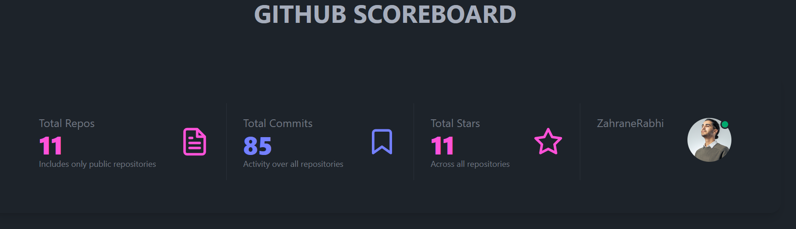

# Angular GitHub Stats Dashboard

Angular GitHub Stats is a component for Angular applications that fetches data from GitHub and showcases them in a stats card format.

# Preview


## Features

- Display total number of repositories
- Display total number of commits across all repositories
- Display total number of stars across all repositories
- Display user's avatar

## Installation

1. ***Clone the repository:***

   ```bash
   git clone https://github.com/ZahraneRabhi/angular-github-scoreboard-component.git
    ```

2. ***Install Dependencies:***
   ```bash
   cd angular-github-scoreboard-component
   npm install
   ```

This library uses TailwindCSS classes by default. Still, it should work with any CSS framework since all the CSS classes are configurable.

To install TailwindCSS for Angular, follow this official documentation: [https://tailwindcss.com/docs/guides/angular](https://tailwindcss.com/docs/guides/angular)

## Notes
This component uses the free tier GitHub API endpoints, which have limited API calls. As a result, the component may not always display the stats correctly.